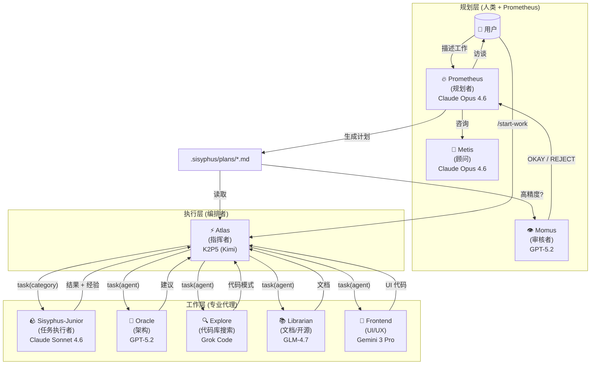
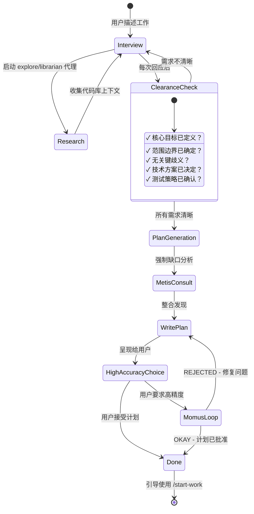
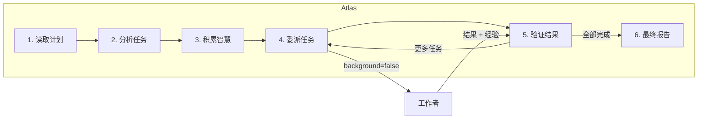
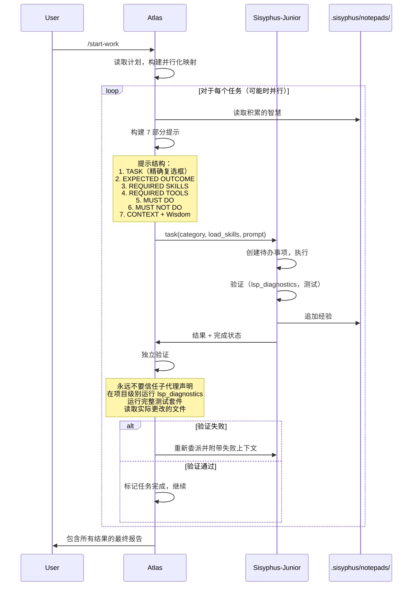

# 理解编排系统

Oh My OpenCode 的编排系统将简单的 AI 代理转变为协调的开发团队。本文档解释 Prometheus → Atlas → Junior 工作流如何创建高质量、可靠的代码输出。

---

## 核心理念

传统 AI 编码工具遵循简单模式：用户提问 → AI 回应。这对小任务有效，但对复杂工作会失败，因为：

1. **上下文过载**：大任务超出上下文窗口
2. **认知漂移**：AI 在任务中途丢失需求追踪
3. **验证缺口**：没有系统化的方式确保完整性
4. **人类 = 瓶颈**：需要持续的用户干预

编排系统通过**专业化和委派**解决这些问题。

---

## 三层架构



---

## 第 1 层：规划 (Prometheus + Metis + Momus)

### Prometheus：你的战略顾问

Prometheus **不仅仅是一个规划者**，它是一个智能访谈者，帮助你思考你真正需要什么。

**访谈流程：**



**基于意图的策略：**

Prometheus 根据你正在做的事情调整访谈风格：

| 意图 | Prometheus 焦点 | 示例问题 |
|------|-----------------|----------|
| **重构** | 安全性 - 行为保持 | "哪些测试验证当前行为？" "回滚策略？" |
| **从零构建** | 发现 - 模式优先 | "在代码库中发现模式 X。遵循还是偏离？" |
| **中等任务** | 护栏 - 精确边界 | "什么必须不包含？硬性约束？" |
| **架构** | 战略 - 长期影响 | "预期寿命？规模要求？" |

### Metis：缺口分析器

在 Prometheus 编写计划之前，**Metis 会发现 Prometheus 遗漏的内容**：

- 用户请求中隐藏的意图
- 可能导致实现偏离的歧义
- AI 烂文模式（过度工程、范围蔓延）
- 缺失的验收标准
- 未处理的边缘情况

**Metis 存在的原因：**

计划作者 (Prometheus) 有"ADHD 工作记忆"，它建立的连接从未被记录下来。Metis 强制将隐性知识外化。

### Momus：无情的审核者

对于高精度模式，Momus 根据**四个核心标准**验证计划：

1. **清晰度**：每个任务是否指定了在何处找到实现细节？
2. **可验证性**：验收标准是否具体且可衡量？
3. **上下文**：是否有足够的上下文可以在没有 >10% 猜测的情况下进行？
4. **大局观**：目的、背景和工作流程是否清晰？

**Momus 循环：**

Momus 只在以下情况说"OKAY"：
- 100% 的文件引用已验证
- ≥80% 的任务有清晰的参考来源
- ≥90% 的任务有具体的验收标准
- 零任务需要对业务逻辑的假设
- 零关键危险信号

如果 REJECTED，Prometheus 修复问题并重新提交。**无最大重试次数限制。**

---

## 第 2 层：执行 (Atlas)

### 指挥者思维

编排者就像管弦乐指挥：**它不演奏乐器，它确保完美的和谐**。



**编排者可以做什么：**
- ✅ 读取文件以理解上下文
- ✅ 运行命令以验证结果
- ✅ 使用 lsp_diagnostics 检查错误
- ✅ 使用 grep/glob/ast-grep 搜索模式

**编排者必须委派什么：**
- ❌ 编写/编辑代码文件
- ❌ 修复 bug
- ❌ 创建测试
- ❌ Git 提交

### 智慧积累

编排的力量是**累积学习**。每个任务之后：

1. 从子代理的响应中提取经验
2. 分类为：约定、成功、失败、陷阱、命令
3. 传递给所有后续子代理

这可以防止重复错误并确保一致的模式。

**记事本系统：**

```
.sisyphus/notepads/{plan-name}/
├── learnings.md      # 模式、约定、成功的方法
├── decisions.md      # 架构选择和理由
├── issues.md         # 遇到的问题、阻塞、陷阱
├── verification.md   # 测试结果、验证结果
└── problems.md       # 未解决的问题、技术债务
```

### 并行执行

独立任务并行运行：

```typescript
// 编排者从计划中识别可并行化的组
// A 组：任务 2、3、4（无文件冲突）
task(category="ultrabrain", prompt="Task 2...")
task(category="visual-engineering", prompt="Task 3...")
task(category="general", prompt="Task 4...")
// 全部同时运行
```

---

## 第 3 层：工作者 (专业代理)

### Sisyphus-Junior：任务执行者

Junior 是实际编写代码的**主力**。关键特征：

- **专注**：不能委派（被阻止使用 task 工具）
- **自律**：强迫性的待办事项追踪
- **已验证**：必须在完成前通过 lsp_diagnostics
- **受限**：不能修改计划文件（只读）

**为什么 Sonnet 足够：**

Junior 不需要是最聪明的，它需要的是可靠。有了：
1. 来自编排者的详细提示（50-200 行）
2. 向前传递的积累智慧
3. 清晰的必须做 / 禁止做约束
4. 验证要求

即使是中端模型也能精确执行。智能在于**系统**，而不是单个代理。

### 系统提醒机制

钩子系统确保 Junior 永远不会半途而废：

```
[SYSTEM REMINDER - TODO CONTINUATION]

你有未完成的待办事项！在回应前完成所有：
- [ ] 实现用户服务 ← 进行中
- [ ] 添加验证
- [ ] 编写测试

在所有待办事项标记完成之前不要回应。
```

这种"巨石推动"机制是系统以 Sisyphus 命名的原因。

---

## task 工具：类别 + 技能系统

### 为什么类别是革命性的

**模型名称的问题：**

```typescript
// 旧：模型名称创建分布偏差
task(agent="gpt-5.2", prompt="...")  // 模型知道自己的局限性
task(agent="claude-opus-4.6", prompt="...")  // 不同的自我认知
```

**解决方案：语义类别：**

```typescript
// 新：类别描述意图，而不是实现
task(category="ultrabrain", prompt="...")     // "战略性思考"
task(category="visual-engineering", prompt="...")  // "美观设计"
task(category="quick", prompt="...")          // "快速完成"
```

### 内置类别

| 类别 | 模型 | 使用场景 |
|------|------|----------|
| `visual-engineering` | Gemini 3 Pro | 前端、UI/UX、设计、样式、动画 |
| `ultrabrain` | GPT-5.3 Codex (xhigh) | 深度逻辑推理、复杂架构决策 |
| `artistry` | Gemini 3 Pro (max) | 高度创意/艺术任务、新颖想法 |
| `quick` | Claude Haiku 4.5 | 琐碎任务 - 单文件更改、错字修复 |
| `deep` | GPT-5.3 Codex (medium) | 目标导向的自主问题解决、彻底研究 |
| `unspecified-low` | Claude Sonnet 4.6 | 不适合其他类别的任务，低工作量 |
| `unspecified-high` | Claude Opus 4.6 (max) | 不适合其他类别的任务，高工作量 |
| `writing` | K2P5 (Kimi) | 文档、散文、技术写作 |

### 自定义类别

你可以定义自己的类别：

```json
// .opencode/oh-my-opencode.json
{
  "categories": {
    "unity-game-dev": {
      "model": "openai/gpt-5.2",
      "temperature": 0.3,
      "prompt_append": "You are a Unity game development expert..."
    }
  }
}
```

### 技能：领域特定指令

技能将专业指令前置到子代理提示中：

```typescript
// 类别 + 技能组合
task(
  category="visual-engineering", 
  load_skills=["frontend-ui-ux"],  // 添加 UI/UX 专业知识
  prompt="..."
)

task(
  category="general",
  load_skills=["playwright"],  // 添加浏览器自动化专业知识
  prompt="..."
)
```

**演进示例：**

| 之前 | 之后 |
|------|------|
| 硬编码：`frontend-ui-ux-engineer` (Gemini 3 Pro) | `category="visual-engineering" + load_skills=["frontend-ui-ux"]` |
| 一刀切 | `category="visual-engineering" + load_skills=["unity-master"]` |
| 模型偏差 | 基于类别：模型抽象消除偏差 |

---

## 编排者 → Junior 工作流



---

## 为什么这个架构有效

### 1. 关注点分离

- **规划** (Prometheus)：高推理、访谈、战略思考
- **编排** (Atlas)：协调、验证、智慧积累
- **执行** (Junior)：专注实现、无干扰

### 2. 显式优于隐式

每个 Junior 提示包括：
- 计划中的精确任务
- 清晰的成功标准
- 禁止的操作
- 所有积累的智慧
- 带行号的参考文件

无假设。无猜测。

### 3. 信任但验证

编排者**从不信任子代理声明**：
- 在项目级别运行 `lsp_diagnostics`
- 执行完整测试套件
- 读取实际文件更改
- 交叉引用需求

### 4. 模型优化

昂贵的模型 (Opus, GPT-5.2) 仅在需要的地方使用：
- 规划决策（每个项目一次）
- 调试咨询（罕见）
- 复杂架构（罕见）

批量工作交给具有成本效益的模型 (Sonnet, Haiku, Flash)。

---

## 开始使用

1. **进入 Prometheus 模式**：在提示符处按 **Tab**
2. **描述你的工作**："我想给我的应用添加用户认证"
3. **回答访谈问题**：Prometheus 会询问模式、偏好、约束
4. **审查计划**：检查 `.sisyphus/plans/` 生成的工作计划
5. **运行 `/start-work`**：编排者接管
6. **观察**：观察任务在验证中完成
7. **完成**：所有待办事项完成，代码已验证，准备发布

---

## 延伸阅读

- [概述](./overview.md) - 快速入门指南
- [Ultrawork 宣言](../ultrawork-manifesto.md) - 系统背后的理念
- [安装指南](./installation.md) - 详细安装说明
- [配置](../configurations.md) - 自定义编排
