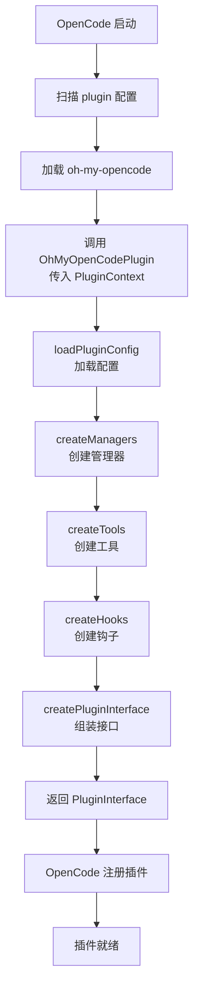

# oh-my-opencode 插件整合机制详解

## 概述

oh-my-opencode 是一个 OpenCode 插件（npm: `oh-my-opencode`），通过 OpenCode 的 Plugin API 实现深度整合。本文档从技术实现角度详细说明插件如何与 OpenCode 集成。

## 核心架构

### OpenCode Plugin API

OpenCode 提供了一个基于 TypeScript 的 Plugin API，定义在 `@opencode-ai/plugin` 包中。插件本质是一个异步函数，接收 `PluginContext`，返回 `PluginInterface`：

```typescript
import type { Plugin } from "@opencode-ai/plugin"

const OhMyOpenCodePlugin: Plugin = async (ctx) => {
  // 初始化逻辑...
  return {
    tool: {...},           // 工具注册
    config: handler,       // 配置处理器
    "chat.message": handler,
    "chat.params": handler,
    event: handler,
    // ...
  }
}

export default OhMyOpenCodePlugin
```

## 初始化流程

### 流程图



### 5 步初始化详解

```typescript
// src/index.ts
const OhMyOpenCodePlugin: Plugin = async (ctx) => {
  // Step 1: 加载配置（多级合并 + Zod 验证）
  const pluginConfig = loadPluginConfig(ctx.directory, ctx)
  
  // Step 2: 创建管理器（4 个核心管理器）
  const managers = createManagers({
    ctx,
    pluginConfig,
    tmuxConfig,
    modelCacheState,
    backgroundNotificationHookEnabled,
  })
  
  // Step 3: 创建工具（26 个工具）
  const toolsResult = await createTools({
    ctx,
    pluginConfig,
    managers,
  })
  
  // Step 4: 创建 Hooks（44 个钩子，3 层架构）
  const hooks = createHooks({
    ctx,
    pluginConfig,
    modelCacheState,
    backgroundManager: managers.backgroundManager,
    isHookEnabled,
    safeHookEnabled,
    mergedSkills: toolsResult.mergedSkills,
    availableSkills: toolsResult.availableSkills,
  })
  
  // Step 5: 组装 PluginInterface（8 个 OpenCode hooks）
  const pluginInterface = createPluginInterface({
    ctx,
    pluginConfig,
    firstMessageVariantGate,
    managers,
    hooks,
    tools: toolsResult.filteredTools,
  })
  
  return {
    ...pluginInterface,
    "experimental.session.compacting": async (input, output) => {
      // 会话压缩处理
    },
  }
}
```

## OpenCode Hook Handlers

插件通过 8 个 Hook Handlers 与 OpenCode 交互：

| Hook | 文件 | 用途 |
|------|------|------|
| `tool` | `plugin/tool-registry.ts` | 注册 26 个自定义工具 |
| `config` | `plugin-handlers/config-handler.ts` | 6 阶段配置流水线 |
| `chat.message` | `plugin/chat-message.ts` | 消息处理、关键词检测、变体门控 |
| `chat.params` | `plugin/chat-params.ts` | 模型参数调整（thinking、effort） |
| `event` | `plugin/event.ts` | 会话生命周期事件 |
| `tool.execute.before` | `plugin/tool-execute-before.ts` | 工具执行前置守卫 |
| `tool.execute.after` | `plugin/tool-execute-after.ts` | 工具执行后处理 |
| `experimental.chat.messages.transform` | `plugin/messages-transform.ts` | 消息转换、上下文注入 |

## Config Handler 6 阶段流水线

### 时序图

```mermaid
sequenceDiagram
    participant OC as OpenCode
    participant CH as ConfigHandler
    participant P1 as Phase1:Provider
    participant P2 as Phase2:Plugin
    participant P3 as Phase3:Agent
    participant P4 as Phase4:Tool
    participant P5 as Phase5:MCP
    participant P6 as Phase6:Command
    
    OC->>CH: config(configObj)
    CH->>P1: applyProviderConfig()
    Note over P1: 缓存模型限制<br/>检测 anthropic-beta
    
    CH->>P2: loadPluginComponents()
    Note over P2: 加载 Claude Code 插件<br/>10s 超时保护
    
    CH->>P3: applyAgentConfig()
    Note over P3: 5 数据源合并<br/>技能发现<br/>模型解析
    
    CH->>P4: applyToolConfig()
    Note over P4: Agent 工具权限<br/>授予/拒绝
    
    CH->>P5: applyMcpConfig()
    Note over P5: 合并 MCP 服务器<br/>Builtin+CC+Plugin
    
    CH->>P6: applyCommandConfig()
    Note over P6: 9 并行源合并<br/>Commands+Skills
    
    CH-->>OC: 配置完成
```



### 代码实现

```typescript
// src/plugin-handlers/config-handler.ts
export function createConfigHandler(deps: ConfigHandlerDeps) {
  return async (config: Record<string, unknown>) => {
    // Phase 1: Provider 配置
    applyProviderConfig({ config, modelCacheState })
    
    // Phase 2: 加载 Claude Code 插件组件
    const pluginComponents = await loadPluginComponents({ pluginConfig })
    
    // Phase 3: Agent 注册（5 数据源）
    const agentResult = await applyAgentConfig({
      config,
      pluginConfig,
      ctx,
      pluginComponents,
    })
    
    // Phase 4: 工具权限配置
    applyToolConfig({ config, pluginConfig, agentResult })
    
    // Phase 5: MCP 合并
    await applyMcpConfig({ config, pluginConfig, pluginComponents })
    
    // Phase 6: Command/Skill 合并
    await applyCommandConfig({ config, pluginConfig, ctx, pluginComponents })
  }
}
```

## 多级配置合并

### 配置优先级

```
用户配置 (~/.config/opencode/oh-my-opencode.jsonc)
    ↓ deepMerge
项目配置 (.opencode/oh-my-opencode.jsonc)
    ↓ Zod 默认值
最终配置
```

### 合并规则

| 字段类型 | 合并策略 |
|----------|----------|
| `agents` | 深度合并（支持单独覆盖） |
| `categories` | 深度合并 |
| `claude_code` | 深度合并 |
| `disabled_*` | Set 并集 |
| `hooks` | 深度合并 |

## Hook 组合架构

### 3 层架构

```typescript
// src/create-hooks.ts
export function createHooks(args) {
  const core = createCoreHooks({...})           // 35 hooks
  const continuation = createContinuationHooks({...}) // 7 hooks
  const skill = createSkillHooks({...})         // 2 hooks
  
  return { ...core, ...continuation, ...skill } // 44 total
}
```

### Hook 分层

```
createHooks()
├── createCoreHooks()              # 35 hooks
│   ├── createSessionHooks()       # 22 hooks
│   │   ├── contextWindowMonitor
│   │   ├── thinkMode
│   │   ├── ralphLoop
│   │   ├── sessionRecovery
│   │   ├── jsonErrorRecovery
│   │   └── ... (17 more)
│   ├── createToolGuardHooks()     # 9 hooks
│   │   ├── commentChecker
│   │   ├── rulesInjector
│   │   ├── writeExistingFileGuard
│   │   └── ... (6 more)
│   └── createTransformHooks()     # 4 hooks
│       ├── claudeCodeHooks
│       ├── keywordDetector
│       ├── contextInjector
│       └── thinkingBlockValidator
├── createContinuationHooks()      # 7 hooks
│   ├── todoContinuationEnforcer
│   ├── atlas
│   ├── stopContinuationGuard
│   └── ... (4 more)
└── createSkillHooks()             # 2 hooks
    ├── categorySkillReminder
    └── autoSlashCommand
```

## 工具注册机制

### Tool Registry

```typescript
// src/plugin/tool-registry.ts
export function createToolRegistry(args): ToolsRecord {
  const tools: ToolsRecord = {}
  
  // 注册所有工具工厂
  const factories = [
    createTaskTool,           // task() 委托工具
    createBackgroundTools,    // 后台任务管理
    createLspTools,          // LSP 工具
    createAstGrepTools,      // AST 搜索工具
    createSessionTools,      // 会话管理工具
    createSkillMcpTool,      // Skill MCP 工具
    // ... 更多工具
  ]
  
  for (const factory of factories) {
    Object.assign(tools, factory(args))
  }
  
  return filterDisabledTools(tools, disabledTools)
}
```

## Agent 注册机制

### 5 数据源合并

```typescript
// src/plugin-handlers/agent-config-handler.ts
const [
  discoveredConfigSourceSkills,    // 配置文件中的 skills
  discoveredUserSkills,            // ~/.claude/skills/
  discoveredProjectSkills,         // .claude/skills/
  discoveredOpencodeGlobalSkills,  // ~/.config/opencode/skills/
  discoveredOpencodeProjectSkills, // .opencode/skills/
] = await Promise.all([...])

// 合并顺序（后覆盖前）:
// builtinAgents → userAgents → projectAgents → pluginAgents → configAgent
```

### Agent Factory 模式

```typescript
// src/agents/builtin-agents.ts
const agentSources: Record<BuiltinAgentName, AgentSource> = {
  sisyphus: createSisyphusAgent,
  hephaestus: createHephaestusAgent,
  oracle: createOracleAgent,
  librarian: createLibrarianAgent,
  explore: createExploreAgent,
  // ...
}

// 每个 factory 遵循统一接口
type AgentFactory = (model: string, ...args) => AgentConfig
AgentFactory.mode = "primary" | "subagent" | "all"
```

## MCP 三层整合

```
MCP 服务器来源
├── Built-in (src/mcp/)
│   ├── websearch (Exa/Tavily)
│   ├── context7 (官方文档)
│   └── grep_app (GitHub 代码搜索)
├── Claude Code (.mcp.json)
│   └── ${VAR} 环境变量展开
└── Plugin (Skills YAML)
    └── SkillMcpManager 管理
```

## 关键文件索引

| 功能 | 文件路径 |
|------|----------|
| 插件入口 | `src/index.ts` |
| 配置加载 | `src/plugin-config.ts` |
| PluginInterface 组装 | `src/plugin-interface.ts` |
| Hook 组合 | `src/create-hooks.ts` |
| Manager 创建 | `src/create-managers.ts` |
| Tool 注册 | `src/plugin/tool-registry.ts` |
| Config Handler | `src/plugin-handlers/config-handler.ts` |
| Agent 注册 | `src/plugin-handlers/agent-config-handler.ts` |
| MCP 合并 | `src/plugin-handlers/mcp-config-handler.ts` |
| Command 合并 | `src/plugin-handlers/command-config-handler.ts` |

## 总结

oh-my-opencode 通过以下机制与 OpenCode 深度整合：

1. **Plugin API**: 实现 `Plugin` 类型，返回 `PluginInterface`
2. **5 步初始化**: Config → Managers → Tools → Hooks → Interface
3. **8 个 Hook Handlers**: 覆盖 OpenCode 的完整生命周期
4. **6 阶段配置流水线**: Provider → Plugin → Agent → Tool → MCP → Command
5. **44 个内部 Hooks**: 3 层架构，可配置启用/禁用
6. **多级配置合并**: User → Project → Defaults
7. **三层 MCP 整合**: Built-in + Claude Code + Plugin
