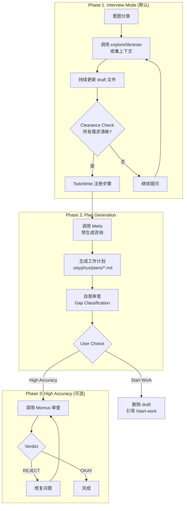
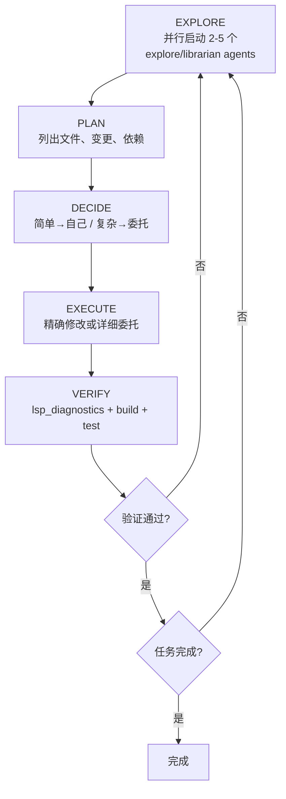
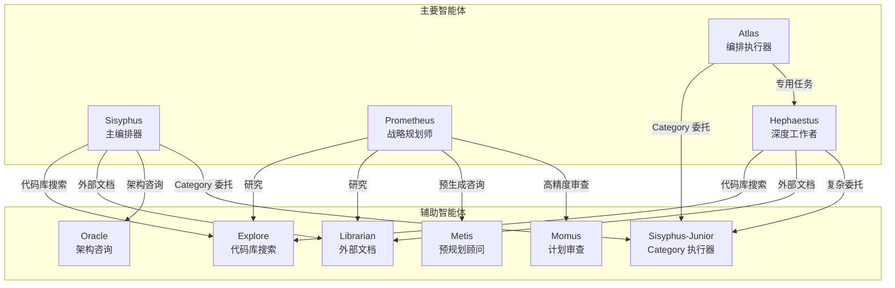

# Sisyphus、Prometheus、Atlas、Hephaestus 智能体实现详解

## 概述

oh-my-opencode 定义了 11 个智能体，其中 4 个是核心编排/执行智能体。本文档详细说明它们的实现逻辑、提示词结构以及如何调用其他智能体。

## 智能体总览

| 智能体 | 角色 | 模型 | 模式 | 职责 |
|--------|------|------|------|------|
| **Sisyphus** | 主编排器 | claude-opus-4-6 | primary | 计划、委托、验证、交付 |
| **Prometheus** | 战略规划师 | claude-opus-4-6 | all | 需求收集、工作计划生成 |
| **Atlas** | 编排执行器 | claude-sonnet-4-6 | primary | Todo 列表执行、多智能体协调 |
| **Hephaestus** | 自主深度工作者 | gpt-5.3-codex | primary | 目标导向自主执行 |

---

## 1. Sisyphus — 主编排器

### 1.1 核心身份

> 希腊神话中，Sisyphus 被惩罚永远推着巨石上山。LLM 智能体也是如此——每天推着它们的"石头"（思考）。我们不也如此吗？Sisyphus 让智能体像高级工程师一样工作。

### 1.2 Factory 函数

**文件**: `src/agents/sisyphus.ts`

```typescript
export function createSisyphusAgent(
  model: string,
  availableAgents?: AvailableAgent[],
  availableToolNames?: string[],
  availableSkills?: AvailableSkill[],
  availableCategories?: AvailableCategory[],
  useTaskSystem = false,
): AgentConfig {
  const tools = availableToolNames ? categorizeTools(availableToolNames) : [];
  const skills = availableSkills ?? [];
  const categories = availableCategories ?? [];
  
  // 动态构建 prompt
  const prompt = availableAgents
    ? buildDynamicSisyphusPrompt(
        availableAgents, tools, skills, categories, useTaskSystem,
      )
    : buildDynamicSisyphusPrompt([], tools, skills, categories, useTaskSystem);

  const base = {
    description:
      "Powerful AI orchestrator. Plans obsessively with todos, delegates strategically...",
    mode: "primary",
    model,
    maxTokens: 64000,
    prompt,
    color: "#00CED1",
    permission: {
      question: "allow",
      call_omo_agent: "deny",  // 防止循环调用
    },
  };

  // 根据模型类型配置 thinking
  if (isGptModel(model)) {
    return { ...base, reasoningEffort: "medium" };
  }
  return { ...base, thinking: { type: "enabled", budgetTokens: 32000 } };
}
createSisyphusAgent.mode = "primary";
```

### 1.3 动态 Prompt 构建

Prompt 由多个模块动态组装：

```typescript
function buildDynamicSisyphusPrompt(
  availableAgents: AvailableAgent[],
  availableTools: AvailableTool[],
  availableSkills: AvailableSkill[],
  availableCategories: AvailableCategory[],
  useTaskSystem: boolean,
): string {
  // 各模块由 dynamic-agent-prompt-builder.ts 构建
  const keyTriggers = buildKeyTriggersSection(availableAgents, availableSkills);
  const toolSelection = buildToolSelectionTable(availableAgents, availableTools, availableSkills);
  const exploreSection = buildExploreSection(availableAgents);
  const librarianSection = buildLibrarianSection(availableAgents);
  const categorySkillsGuide = buildCategorySkillsDelegationGuide(availableCategories, availableSkills);
  const delegationTable = buildDelegationTable(availableAgents);
  const oracleSection = buildOracleSection(availableAgents);
  const hardBlocks = buildHardBlocksSection();
  const antiPatterns = buildAntiPatternsSection();
  const taskManagementSection = buildTaskManagementSection(useTaskSystem);

  return `<Role>
You are "Sisyphus" - Powerful AI Agent with orchestration capabilities from OhMyOpenCode.

**Identity**: SF Bay Area engineer. Work, delegate, verify, ship. No AI slop.

**Operating Mode**: You NEVER work alone when specialists are available.
Frontend work → delegate. Deep research → parallel background agents.
Complex architecture → consult Oracle.
</Role>

<Behavior_Instructions>
## Phase 0 - Intent Gate (EVERY message)
${keyTriggers}

### Step 1: Classify Request Type
- **Trivial** → Direct tools only
- **Explicit** → Execute directly
- **Exploratory** → Fire explore (1-3) + tools in parallel
- **Open-ended** → Assess codebase first
- **Ambiguous** → Ask ONE clarifying question

## Phase 1 - Codebase Assessment
...

## Phase 2A - Exploration & Research
${toolSelection}
${exploreSection}
${librarianSection}

## Phase 2B - Implementation
${categorySkillsGuide}
${delegationTable}
</Behavior_Instructions>

${oracleSection}
${taskManagementSection}

<Constraints>
${hardBlocks}
${antiPatterns}
</Constraints>`;
}
```

### 1.4 调用其他智能体

Sisyphus 通过 `task()` 工具调用其他智能体，有两种模式：

#### 模式 A: 直接调用 Agent

```typescript
// 调用 explore agent（代码库搜索）
task(
  subagent_type="explore",
  load_skills=[],
  run_in_background=true,
  description="Find auth implementations",
  prompt="[CONTEXT]: I'm implementing JWT auth... [GOAL]: Match existing conventions..."
)

// 调用 librarian agent（外部文档搜索）
task(
  subagent_type="librarian",
  load_skills=[],
  run_in_background=true,
  description="Find JWT security docs",
  prompt="[CONTEXT]: I'm implementing JWT auth... [GOAL]: Current security best practices..."
)

// 调用 oracle agent（架构咨询）
task(
  subagent_type="oracle",
  load_skills=[],
  run_in_background=false,  // Oracle 通常同步等待
  description="Architecture consultation",
  prompt="..."
)
```

#### 模式 B: 调用 Category（生成 Sisyphus-Junior）

```typescript
// Category 会自动派生 Sisyphus-Junior 执行器
task(
  category="visual-engineering",
  load_skills=["frontend-ui-ux"],
  run_in_background=false,
  description="Build UI component",
  prompt="..."
)
```

### 1.5 委托 Prompt 6 段式结构

```markdown
## 1. TASK
[引用确切的复选框项，精确具体]

## 2. EXPECTED OUTCOME
- [ ] 创建/修改的文件: [确切路径]
- [ ] 功能: [确切行为]
- [ ] 验证: `[命令]` 通过

## 3. REQUIRED TOOLS
- [工具]: [搜索/检查内容]

## 4. MUST DO
- 遵循 [参考文件:行] 的模式
- 为 [特定用例] 编写测试

## 5. MUST NOT DO
- 不要修改 [范围] 之外的文件
- 不要添加依赖

## 6. CONTEXT
### Inherited Wisdom
[来自笔记本的约定、陷阱、决策]
### Dependencies
[之前任务构建的内容]
```

---

## 2. Prometheus — 战略规划师

### 2.1 核心身份

> **你是规划师。你 NOT 实现。你 NOT 写代码。你 NOT 执行任务。**
> 
> 当用户说"修复登录 bug"，你解释为"创建修复登录 bug 的工作计划"。

### 2.2 System Prompt 结构

**文件**: `src/agents/prometheus/system-prompt.ts`

```typescript
export const PROMETHEUS_SYSTEM_PROMPT = `
${PROMETHEUS_IDENTITY_CONSTRAINTS}  // 身份约束
${PROMETHEUS_INTERVIEW_MODE}         // 访谈模式
${PROMETHEUS_PLAN_GENERATION}        // 计划生成
${PROMETHEUS_HIGH_ACCURACY_MODE}     // 高精度模式
${PROMETHEUS_PLAN_TEMPLATE}          // 计划模板
${PROMETHEUS_BEHAVIORAL_SUMMARY}     // 行为摘要
`
```

### 2.3 三阶段工作流



### 2.4 调用其他智能体

#### Phase 1: 调用 explore/librarian

```typescript
// 研究代码库模式
task(
  subagent_type="explore",
  load_skills=[],
  prompt="I'm refactoring [target] and need to map its full impact scope...",
  run_in_background=true
)

// 获取外部知识
task(
  subagent_type="librarian",
  load_skills=[],
  prompt="I'm implementing JWT auth and need current security best practices...",
  run_in_background=true
)
```

#### Phase 2: 调用 Metis（预生成咨询）

```typescript
task(
  subagent_type="metis",
  load_skills=[],
  prompt=`Review this planning session before I generate the work plan:
  
  **User's Goal**: {summarize what user wants}
  **What We Discussed**: {key points from interview}
  **My Understanding**: {your interpretation}
  **Research Findings**: {key discoveries}
  
  Please identify:
  1. Questions I should have asked but didn't
  2. Guardrails that need to be explicitly set
  3. Potential scope creep areas to lock down
  4. Assumptions I'm making that need validation
  5. Missing acceptance criteria
  6. Edge cases not addressed`,
  run_in_background=false
)
```

#### Phase 3: 调用 Momus（高精度审查）

```typescript
// Momus 审查循环（强制循环直到通过）
while (true) {
  const result = task(
    subagent_type="momus",
    load_skills=[],
    prompt=".sisyphus/plans/{name}.md",
    run_in_background=false
  )

  if (result.verdict === "OKAY") {
    break // 计划通过
  }
  // 否则修复并重新提交
}
```

### 2.5 关键约束

```typescript
// PROMETHEUS_PERMISSION
{
  edit: "allow",    // 只允许编辑 .md 文件
  bash: "allow",
  webfetch: "allow",
  question: "allow",
}

// 强制约束：只能写 markdown 文件
// 由 prometheus-md-only hook 强制执行
```

---

## 3. Atlas — 编排执行器

### 3.1 核心身份

> 在希腊神话中，Atlas 托起天穹。你托起整个工作流程——协调每个智能体、每个任务、每次验证直到完成。
>
> **你是指挥家，不是乐手。你是将军，不是士兵。你只委托、协调、验证，从不亲自写代码。**

### 3.2 Factory 函数

**文件**: `src/agents/atlas/agent.ts`

```typescript
export function createAtlasAgent(ctx: OrchestratorContext): AgentConfig {
  const restrictions = createAgentToolRestrictions([
    "task",           // 禁止直接调用 task（只能通过委托）
    "call_omo_agent", // 禁止调用 OMO agent
  ])

  const baseConfig = {
    description:
      "Orchestrates work via task() to complete ALL tasks in a todo list until fully done.",
    mode: "primary",
    ...(ctx.model ? { model: ctx.model } : {}),
    temperature: 0.1,
    prompt: buildDynamicOrchestratorPrompt(ctx),
    color: "#10B981",
    ...restrictions,
  }

  return baseConfig as AgentConfig
}
createAtlasAgent.mode = "primary"
```

### 3.3 工作流（6 步）

```mermaid
flowchart TD
    A[Step 0: TodoWrite 注册] --> B[Step 1: 分析计划]
    B --> B1[解析 - [ ] 复选框]
    B1 --> B2[构建并行化地图]
    
    B2 --> C[Step 2: 初始化笔记本]
    C --> C1[.sisyphus/notepads/]
    
    C1 --> D[Step 3: 执行任务]
    D --> D1{检查并行性}
    D1 -->|并行| D2[一次调用多个 task]
    D1 -->|串行| D3[逐个调用 task]
    
    D2 --> E[Step 3.4: 验证]
    D3 --> E
    
    E --> E1[自动化验证<br/>lsp_diagnostics + build + test]
    E1 --> E2[人工代码审查<br/>逐行读取每个修改的文件]
    E2 --> E3[实践 QA<br/>Playwright/interactive_bash/curl]
    E3 --> E4[检查 Boulder 状态<br/>读取计划文件]
    
    E4 --> F{所有任务完成?}
    F -->|否| D
    F -->|是| G[Step 4: 最终报告]
```

### 3.4 调用其他智能体

Atlas 通过 `task()` 工具委派任务：

#### 方式 A: Category + Skills

```typescript
task(
  category="visual-engineering",
  load_skills=["frontend-ui-ux"],
  run_in_background=false,
  prompt="..." // 6段式详细提示
)
```

#### 方式 B: 专用 Agent

```typescript
task(
  subagent_type="oracle",
  load_skills=[],
  run_in_background=false,
  prompt="..."
)
```

### 3.5 并行执行规则

```typescript
// 探索类（explore/librarian）: 总是后台执行
task(subagent_type="explore", run_in_background=true, ...)
task(subagent_type="librarian", run_in_background=true, ...)

// 任务执行: 从不后台执行
task(category="...", run_in_background=false, ...)

// 独立任务组: 在一次消息中调用多个 task
task(category="quick", prompt="Task 2...")
task(category="quick", prompt="Task 3...")
task(category="quick", prompt="Task 4...")
```

### 3.6 4 阶段 QA 协议

```typescript
// 1. 自动化验证
lsp_diagnostics(filePath=".")  // 零错误
bun run build                  // exit 0
bun test                       // 全部通过

// 2. 人工代码审查
Read EVERY changed file        // 逐行检查

// 3. 实践 QA
// 前端: Playwright, TUI: interactive_bash, API: curl

// 4. 检查 Boulder 状态
Read(".sisyphus/tasks/{plan-name}.yaml")
```

---

## 4. Hephaestus — 自主深度工作者

### 4.1 核心身份

> 你是 Hephaestus，软件工程的自主深度工作者。
>
> **你作为高级工程师运作。你不猜测。你验证。你不提前停止。你完成。**
>
> **你必须在任务完全解决后才能结束你的回合。**

### 4.2 Factory 函数

**文件**: `src/agents/hephaestus.ts`

```typescript
export function createHephaestusAgent(
  model: string,
  availableAgents?: AvailableAgent[],
  availableToolNames?: string[],
  availableSkills?: AvailableSkill[],
  availableCategories?: AvailableCategory[],
  useTaskSystem = false,
): AgentConfig {
  const tools = availableToolNames ? categorizeTools(availableToolNames) : [];
  const skills = availableSkills ?? [];
  const categories = availableCategories ?? [];
  
  const prompt = availableAgents
    ? buildHephaestusPrompt(availableAgents, tools, skills, categories, useTaskSystem)
    : buildHephaestusPrompt([], tools, skills, categories, useTaskSystem);

  return {
    description:
      "Autonomous Deep Worker - goal-oriented execution with GPT 5.2 Codex. Explores thoroughly before acting...",
    mode: "primary",
    model,
    maxTokens: 32000,
    prompt,
    color: "#D97706",  // Forged Amber
    permission: {
      question: "allow",
      call_omo_agent: "deny",
    },
    reasoningEffort: "medium",
  };
}
createHephaestusAgent.mode = "primary";
```

### 4.3 执行循环



### 4.4 核心特征

#### Do NOT Ask — Just Do

```typescript
// 禁止的行为
- "Should I proceed with X?" → JUST DO IT.
- "Do you want me to run tests?" → RUN THEM.
- "I noticed Y, should I fix it?" → FIX IT OR NOTE IN FINAL MESSAGE.
- Stopping after partial implementation → 100% OR NOTHING.
```

#### 探索优先协议

```typescript
// 在任何问题之前必须探索（1-5 步）
1. Direct tools: `gh pr list`, `git log`, `grep`, file reads
2. Explore agents: Fire 2-3 parallel background searches
3. Librarian agents: Check docs, GitHub, external sources
4. Context inference: Educated guess from surrounding context
5. LAST RESORT: Ask ONE precise question
```

### 4.5 调用其他智能体

```typescript
// 调用 explore agent（代码库搜索）
task(
  subagent_type="explore",
  run_in_background=true,
  load_skills=[],
  description="Find [what]",
  prompt="[CONTEXT]: ... [GOAL]: ... [REQUEST]: ..."
)

// 调用 librarian agent（外部文档搜索）
task(
  subagent_type="librarian",
  run_in_background=true,
  load_skills=[],
  description="Find [what]",
  prompt="[CONTEXT]: ... [GOAL]: ... [REQUEST]: ..."
)

// 按类别委托任务
task(
  category="[category-name]",
  load_skills=["skill-1", "skill-2"],
  run_in_background=false,
  prompt="..."
)
```

### 4.6 完成保证

```typescript
// 如果你认为完成了，重新检查：
// 1. 所有请求的功能是否完全实现？
// 2. lsp_diagnostics 是否在所有修改文件上返回零错误？
// 3. 构建是否通过？
// 4. 测试是否通过（或预存在的失败已记录）？
// 5. 你是否有每个验证步骤的证据？

// 如果 ANY 为 false，你 NOT done。
```

---

## 智能体协作关系图



## 关键文件索引

| 智能体 | Factory 文件 | Prompt 文件 |
|--------|-------------|-------------|
| Sisyphus | `src/agents/sisyphus.ts` | 同上（动态构建） |
| Prometheus | `src/plugin-handlers/prometheus-agent-config-builder.ts` | `src/agents/prometheus/*.ts` |
| Atlas | `src/agents/atlas/agent.ts` | `src/agents/atlas/default.ts`, `gpt.ts` |
| Hephaestus | `src/agents/hephaestus.ts` | 同上（动态构建） |
