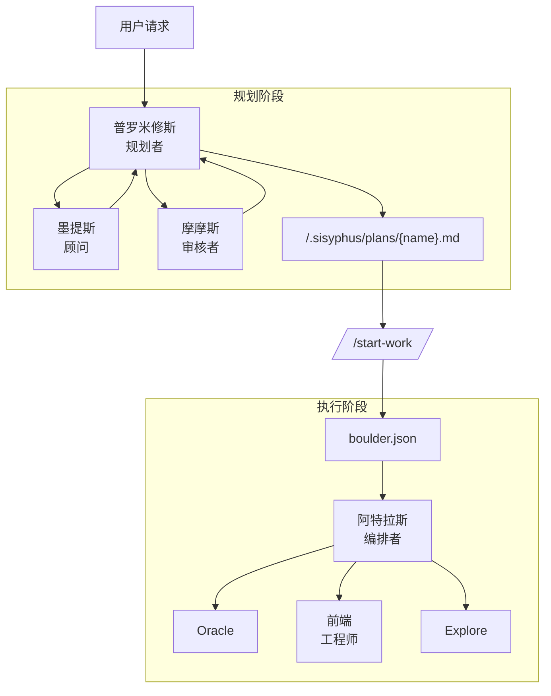

# Oh-My-OpenCode 编排指南

## TL;DR - 何时使用什么

| 复杂度 | 方式 | 使用场景 |
|--------|------|----------|
| **简单** | 直接提示 | 简单任务、快速修复、单文件修改 |
| **复杂 + 懒惰** | 直接输入 `ulw` 或 `ultrawork` | 解释上下文很繁琐的复杂任务。让智能体自己搞定。 |
| **复杂 + 精确** | `@plan` → `/start-work` | 需要真正编排的精确、多步骤工作。普罗米修斯规划，阿特拉斯执行。 |

**决策流程：**

```
是快速修复或简单任务吗？
  └─ 是 → 直接正常提示
  └─ 否 → 解释完整上下文是否繁琐？
              └─ 是 → 输入 "ulw"，让智能体自己搞定
              └─ 否 → 需要精确、可验证的执行吗？
                         └─ 是 → 使用 @plan 进行普罗米修斯规划，然后 /start-work
                         └─ 否 → 直接使用 "ulw"
```

---

本文档提供了编排系统的全面指南，该系统实现了 Oh-My-OpenCode 的核心理念：**"规划与执行分离"**。

## 1. 概述

传统 AI 智能体经常将规划和执行混在一起，导致上下文污染、目标漂移和 AI 劣质代码（低质量代码）。

Oh-My-OpenCode 通过清晰分离两个角色来解决这个问题：

1. **普罗米修斯（规划者）**：从不编写代码的纯战略家。通过访谈和分析建立完美的计划。
2. **阿特拉斯（执行者）**：执行计划的编排者。将工作委派给专业智能体，直到完成为止。

---

## 2. 普罗米修斯调用方式：智能体切换 vs @plan

一个常见的困惑是如何调用普罗米修斯进行规划。**两种方法达到相同的结果** —— 使用你觉得自然的方式。

### 方式 1：切换到普罗米修斯智能体（Tab → 选择 Prometheus）

```
1. 在提示符处按 Tab
2. 从智能体列表中选择 "Prometheus"
3. 描述你的工作："我想重构认证系统"
4. 回答访谈问题
5. 普罗米修斯在 .sisyphus/plans/{name}.md 创建计划
```

### 方式 2：使用 @plan 命令（在西西弗斯中）

```
1. 保持在西西弗斯中（默认智能体）
2. 输入：@plan "我想重构认证系统"
3. @plan 命令自动切换到普罗米修斯
4. 回答访谈问题
5. 普罗米修斯在 .sisyphus/plans/{name}.md 创建计划
```

### 应该使用哪种方式？

| 场景 | 推荐方式 | 原因 |
|------|----------|------|
| **新会话，从头开始** | 切换到普罗米修斯智能体 | 清晰的心智模型 —— 你正在进入"规划模式" |
| **已处于西西弗斯中，工作中** | 使用 @plan | 方便，无需切换智能体 |
| **想要明确控制** | 切换到普罗米修斯智能体 | 规划与执行上下文的清晰分离 |
| **快速规划打断** | 使用 @plan | 从当前上下文出发的最快路径 |

**关键洞察**：两种方法都会触发相同的普罗米修斯规划流程。@plan 命令只是一个便捷快捷方式，它会：
1. 检测你消息中的 `@plan` 关键字
2. 自动将请求路由到普罗米修斯
3. 规划完成后将你返回西西弗斯

---

## 3. 新会话中 /start-work 的行为

编排系统最强大的功能之一是**会话连续性**。理解 `/start-work` 在会话间的行为可以避免困惑。

### 运行 /start-work 时会发生什么

```
用户：/start-work
    ↓
[start-work 钩子激活]
    ↓
检查：.sisyphus/boulder.json 是否存在？
    ↓
    ├─ 是（现有工作）→ 恢复模式
    │   - 读取现有的巨石状态
    │   - 计算进度（已勾选 vs 未勾选框）
    │   - 注入剩余任务的继续提示
    │   - 阿特拉斯从你离开的地方继续
    │
    └─ 否（全新开始）→ 初始化模式
        - 在 .sisyphus/plans/ 中查找最近的计划
        - 创建新的 boulder.json 追踪此计划
        - 将会话智能体切换到阿特拉斯
        - 从任务 1 开始执行
```

### 会话连续性说明

`boulder.json` 文件追踪：
- **active_plan**：当前计划文件的路径
- **session_ids**：所有处理过此计划的会话
- **started_at**：工作开始时间
- **plan_name**：人类可读的计划标识符

**示例时间线：**

```
周一上午 9:00
  └─ @plan "构建用户认证"
  └─ 普罗米修斯访谈并创建计划
  └─ 用户：/start-work
  └─ 阿特拉斯开始执行，创建 boulder.json
  └─ 任务 1 完成，任务 2 进行中...
  └─ [会话结束 - 电脑崩溃、用户登出等]

周一下午 2:00（新会话）
  └─ 用户打开新会话（智能体 = 西西弗斯，默认）
  └─ 用户：/start-work
  └─ [start-work 钩子读取 boulder.json]
  └─ "恢复 '构建用户认证' - 8 个任务中已完成 3 个"
  └─ 阿特拉斯从任务 3 继续（无上下文丢失）
```

### 何时不需要手动切换到阿特拉斯

当你运行 `/start-work` 时，阿特拉斯会**自动激活**。你不需要：
- 手动切换到阿特拉斯智能体
- 记住你正在使用哪个智能体
- 担心会话连续性

`/start-work` 命令会处理所有这些。

### 何时可能需要手动切换到阿特拉斯

在某些罕见情况下，手动切换智能体会有帮助：

| 场景 | 操作 | 原因 |
|------|------|------|
| **计划文件被手动编辑** | 切换到阿特拉斯，直接读取计划 | 绕过 boulder.json 恢复逻辑 |
| **调试编排问题** | 切换到阿特拉斯以获得可见性 | 查看阿特拉斯特定的系统提示 |
| **强制重新执行** | 删除 boulder.json，然后 /start-work | 从任务 1 开始而不是恢复 |
| **多计划管理** | 切换到阿特拉斯以选择特定计划 | 覆盖自动选择 |

**手动切换命令：** 按 `Tab` → 选择 "Atlas"

---

## 4. 执行模式：赫菲斯托斯 vs 西西弗斯+ultrawork

另一个常见问题：**什么时候应该使用赫菲斯托斯，而不是直接在西西弗斯中输入 `ulw`？**

### 快速对比

| 方面 | 赫菲斯托斯 | 西西弗斯 + `ulw` / `ultrawork` |
|------|-----------|-------------------------------|
| **模型** | GPT-5.3 Codex（中等推理） | Claude Opus 4.6（你的默认） |
| **方式** | 自主深度工作者 | 关键字激活的 ultrawork 模式 |
| **最佳用于** | 复杂架构工作、深度推理 | 通用复杂任务、"直接干"场景 |
| **规划** | 执行过程中自行规划 | 如有可用则使用普罗米修斯计划 |
| **委派** | 大量使用 explore/librarian 智能体 | 使用基于类别的委派 |
| **温度** | 0.1 | 0.1 |

### 何时使用赫菲斯托斯

在以下情况下切换到赫菲斯托斯（Tab → 选择 Hephaestus）：

1. **需要深度架构推理**
   - "设计一个新的插件系统"
   - "将这个单体应用重构为微服务"

2. **需要推理链的复杂调试**
   - "为什么这个竞态条件只在周二发生？"
   - "通过 15 个文件追踪这个内存泄漏"

3. **跨领域知识综合**
   - "将我们的 Rust 核心与 TypeScript 前端集成"
   - "零停机时间从 MongoDB 迁移到 PostgreSQL"

4. **你特别想要 GPT-5.3 Codex 的推理**
   - 某些问题受益于 GPT-5.3 Codex 的训练特性

**示例：**
```
[切换到赫菲斯托斯]
"我需要理解数据如何在整个系统中流动，
并识别所有可能丢失事务的地方。
在提出修复方案之前彻底探索。"
```

### 何时使用西西弗斯 + `ulw` / `ultrawork`

在以下情况下在西西弗斯中使用 `ulw` 关键字：

1. **你希望智能体自己搞定**
   - "ulw 修复失败的测试"
   - "ulw 给 API 添加输入验证"

2. **复杂但范围明确的任务**
   - "ulw 按照我们的模式实现 JWT 认证"
   - "ulw 为部署创建一个新的 CLI 命令"

3. **你感觉懒惰**（官方支持的使用场景）
   - 不想写详细需求
   - 信任智能体去探索和决策

4. **你想利用现有计划**
   - 如果存在普罗米修斯计划，`ulw` 模式可以使用它
   - 如果没有计划，则回退到自主探索

**示例：**
```
[保持在西西弗斯中]
"ulw 重构用户服务以使用新的仓库模式"

[智能体自动：]
- 探索现有代码库模式
- 实现重构
- 运行验证（测试、类型检查）
- 报告完成
```

### 实践中的关键区别

| 赫菲斯托斯 | 西西弗斯 + ulw |
|-----------|----------------|
| 你手动切换到赫菲斯托斯智能体 | 你在任何西西弗斯会话中输入 `ulw` |
| GPT-5.3 Codex 带中等推理 | 你配置的默认模型 |
| 专为自主深度工作优化 | 专为通用执行优化 |
| 始终使用探索优先方法 | 如有可用则尊重现有计划 |
| "无需监督的聪明实习生" | "遵循你工作流程的聪明实习生" |

### 建议

**对于大多数用户**：在西西弗斯中使用 `ulw` 关键字。这是默认路径，对 90% 的复杂任务效果极佳。

**对于高级用户**：当你特别需要 GPT-5.3 Codex 的推理风格或想要"AmpCode 深度模式"的完全自主探索和执行体验时，切换到赫菲斯托斯。

---

## 5. 整体架构



---

## 6. 关键组件

### 🔮 普罗米修斯（规划者）

- **模型**：`anthropic/claude-opus-4-6`
- **角色**：战略规划、需求访谈、工作计划创建
- **约束**：**只读**。只能在 `.sisyphus/` 目录内创建/修改 markdown 文件。
- **特性**：从不直接编写代码，只专注于"如何做"。

### 🦉 墨提斯（计划顾问）

- **角色**：预分析和差距检测
- **功能**：识别隐藏的用户意图、防止 AI 过度工程化、消除歧义。
- **工作流**：计划创建前必须进行墨提斯咨询。

### ⚖️ 摩摩斯（计划审核者）

- **角色**：高精度计划验证（高精度模式）
- **功能**：拒绝并要求修订，直到计划完美。
- **触发**：当用户请求"高精度"时激活。

### ⚡ 阿特拉斯（计划执行者）

- **模型**：`anthropic/claude-sonnet-4-6`（扩展思维 32k）
- **角色**：执行和委派
- **特性**：不直接做所有事情，主动委派给专业智能体（前端、图书管理员等）。

---

## 7. 工作流

### 阶段 1：访谈和规划（访谈模式）

普罗米修斯默认以**访谈模式**启动。它不会立即创建计划，而是收集足够的上下文。

1. **意图识别**：分类用户请求是重构还是新功能。
2. **上下文收集**：通过 `explore` 和 `librarian` 智能体调查代码库和外部文档。
3. **草稿创建**：在 `.sisyphus/drafts/` 中持续记录讨论内容。

### 阶段 2：计划生成

当用户请求"制定计划"时，开始计划生成。

1. **墨提斯咨询**：确认任何遗漏的需求或风险因素。
2. **计划创建**：在 `.sisyphus/plans/{name}.md` 文件中写入单个计划。
3. **交接**：计划创建完成后，引导用户使用 `/start-work` 命令。

### 阶段 3：执行

当用户输入 `/start-work` 时，开始执行阶段。

1. **状态管理**：创建/读取 `boulder.json` 文件以追踪当前计划和会话 ID。
2. **任务执行**：阿特拉斯读取计划并逐个处理待办事项。
3. **委派**：UI 工作委派给前端智能体，复杂逻辑委派给 Oracle。
4. **连续性**：即使会话中断，工作也会通过 `boulder.json` 在下一个会话中继续。

---

## 8. 命令和使用

### `@plan [请求]`

从西西弗斯调用普罗米修斯开始规划会话。

- 示例：`@plan "我想将认证系统重构为 NextAuth"`
- 效果：路由到普罗米修斯，规划完成后返回西西弗斯

### `/start-work`

执行生成的计划。

- **新会话**：在 `.sisyphus/plans/` 中查找计划并进入执行模式
- **现有巨石**：从你离开的地方恢复（读取 boulder.json）
- **效果**：如果尚未激活，自动切换到阿特拉斯智能体

### 手动切换智能体

在提示符处按 `Tab` 查看可用智能体：

| 智能体 | 何时切换 |
|--------|----------|
| **Prometheus** | 你想创建详细的工作计划 |
| **Atlas** | 你想手动控制计划执行（罕见） |
| **Hephaestus** | 你需要 GPT-5.3 Codex 进行深度自主工作 |
| **Sisyphus** | 返回默认智能体进行正常提示 |

---

## 9. 配置指南

你可以在 `oh-my-opencode.json` 中控制相关功能。

```jsonc
{
  "sisyphus_agent": {
    "disabled": false,           // 启用阿特拉斯编排（默认：false）
    "planner_enabled": true,     // 启用普罗米修斯（默认：true）
    "replace_plan": true         // 用普罗米修斯替换默认计划智能体（默认：true）
  },
  
  // 钩子设置（添加以禁用）
  "disabled_hooks": [
    // "start-work",             // 禁用执行触发器
    // "prometheus-md-only"      // 移除普罗米修斯写入限制（不推荐）
  ]
}
```

---

## 10. 最佳实践

1. **不要急于规划**：在普罗米修斯访谈中投入足够的时间。计划越完美，执行越快。

2. **单一计划原则**：无论任务多大，将所有待办事项包含在一个计划文件（`.md`）中。这可以防止上下文碎片化。

3. **主动委派**：在执行过程中，通过 `task` 委派给专业智能体，而不是直接修改代码。

4. **信任 /start-work 连续性**：不用担心会话中断。`/start-work` 总是从 boulder.json 恢复你的工作。

5. **使用 `ulw` 便利**：有疑问时，输入 `ulw` 让系统找出最佳方法。

6. **将赫菲斯托斯保留给深度工作**：不要过度思考智能体选择。赫菲斯托斯在真正复杂的架构挑战中表现出色。

---

## 11. 常见困惑故障排除

### "我切换到普罗米修斯但什么也没发生"

普罗米修斯默认进入**访谈模式**。它会问你关于需求的问题。回答它们，准备好后说"制定计划"。

### "/start-work 提示'未找到活动计划'"

可能是：
- `.sisyphus/plans/` 中没有计划 → 先用普罗米修斯创建一个
- 计划存在但 boulder.json 指向别处 → 删除 `.sisyphus/boulder.json` 后重试

### "我在阿特拉斯中但想切换回正常模式"

输入 `exit` 或开始新会话。阿特拉斯主要通过 `/start-work` 进入 —— 你通常不会手动"切换到阿特拉斯"。

### "@plan 和直接切换到普罗米修斯有什么区别？"

**功能上没有区别。** 两者都调用普罗米修斯。@plan 是便捷命令，而切换智能体是明确控制。使用你觉得自然的方式。

### "我应该使用赫菲斯托斯还是输入 ulw？"

**对于大多数任务**：在西西弗斯中输入 `ulw`。

**使用赫菲斯托斯当**：你特别需要 GPT-5.3 Codex 的推理风格进行深度架构工作或复杂调试。
